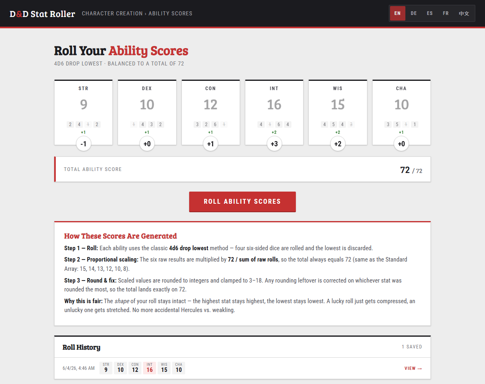

# D&D Stat Roller

A balanced **4d6-drop-lowest** ability score roller for D&D 5e — styled after D&D Beyond. Every roll is automatically scaled so the six final scores **always sum to 72** (same total as the official Standard Array), eliminating power swings between characters without flattening the shape of the roll.

🎲 **Live:** https://sirrio.github.io/dnd-stat-roller/



## Features

- 🎲 Classic **4d6 drop lowest** for all six abilities (STR, DEX, CON, INT, WIS, CHA)
- ⚖ **Proportional balancing** — total always equals 72; rank order of your rolls is preserved
- 🎨 D&D Beyond-inspired UI with crimson accents and Bree Serif headings
- 🌍 **5 languages** built in: EN, DE, ES, FR, 中文 (switch in top-right)
- 📜 **Local history** of up to 20 past rolls (stored in `localStorage`) — click any entry to re-display it
- 📱 Mobile-friendly responsive layout

## How the balancing works

1. **Roll** 4d6 drop lowest for each of the 6 abilities.
2. **Scale** every value by `72 / sum_of_raw_rolls` (a float).
3. **Round** to integers and clamp to the 3–18 range.
4. **Fix** any rounding leftover by nudging the stat that was rounded the most, until the total lands exactly on 72.

This preserves the *shape* of your roll: the highest score stays the highest, the lowest stays the lowest. A lucky roll just gets compressed, an unlucky one stretched. No more Hercules-vs-weakling at the same table by sheer luck.

## Running locally

It's a single static `index.html` — no build step, no dependencies.

```sh
# just open it
start index.html

# or serve it (any static server works)
python -m http.server 8000
```

## Deploying

Already deployed via **GitHub Pages** from the `main` branch (root). Push to `main` and the live site updates automatically.

## License

[MIT](LICENSE) — do whatever you want.
